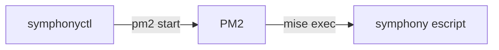

# 런처

`symphonyctl`은 Symphony 인스턴스를 PM2 프로세스로 관리하는 CLI다. 인스턴스는 target 별칭과 워크플로의 조합이고, 실행 본체는 `elixir/bin/symphony` escript, 프롬프트는 `workflows/<워크플로>.md`다.



진입점은 `symphonyctl.mts` 단일 파일이다. Node 24의 네이티브 type stripping으로 그대로 실행하므로 빌드가 없고, `symphonyctl` 이름은 이 파일을 가리키는 심볼릭 링크나 셸 `alias`로 사용자가 만든다. PM2와 `mise`는 `PATH`에서 해석하므로 전역 설치가 필요하다.

escript는 다음 인자로 기동한다.

- `--logs-root ~/.local/state/symphony/<별칭>-<워크플로>`: 인스턴스별 로그 루트. escript는 그 아래 `log/symphony.log.<N>` 순환 파일에 기록한다.
- `--i-understand-that-this-will-be-running-without-the-usual-guardrails`: 업스트림의 무인 실행 확인 플래그. 런처는 이 플래그를 항상 전달하므로 모든 인스턴스가 이 확인을 승인한 상태로 기동된다.
- `--port`는 넘기지 않으므로 상태 대시보드는 시작되지 않는다. 작업 관측은 Slack 알림([`notifier/`](../notifier/README.md))과 트래커가 맡는다.

## 명령

```sh
symphonyctl start <별칭>... [--workflow <워크플로>] | --all
symphonyctl restart [<별칭>...] [--workflow <워크플로>]
symphonyctl stop [<별칭>...] [--workflow <워크플로>]
symphonyctl ls
symphonyctl logs <별칭> --workflow <워크플로>
symphonyctl run <별칭> --workflow <워크플로>
symphonyctl notifier start|stop|restart|logs
```

- `--workflow`를 생략하면 별칭의 활성 워크플로 전체가 대상이다 (`logs`, `run` 제외). `restart`와 `stop`은 별칭까지 생략하면 실행 중인 인스턴스 전체가 대상이고, `--all`은 받지 않는다.
- `--all`은 `start` 전용으로 레지스트리 전체를 기동한다. `--workflow`와 함께 쓰면 해당 워크플로를 켜지 않은 target은 오류 없이 건너뛴다. 별칭으로 지정한 target에 그 워크플로가 없으면 실패한다.
- `start`는 online 상태인 인스턴스만 건너뛴다. errored 등 다른 상태로 등록돼 있으면 `pm2 delete` 후 새로 등록한다.
- `stop`은 `pm2 stop`이 아니라 `pm2 delete`로 등록을 해제한다. 등록된 프로세스는 모두 실행 중이어야 한다는 전제를 유지하기 위해서다.
- `ls`는 PM2 프로세스 목록 기준이다. 레지스트리에 있어도 실행 중이 아닌 인스턴스는 나오지 않고, 알림 서버는 별칭 칸에 `알림`으로 함께 표시된다.
- `logs`는 escript가 남기는 disk_log 순환 파일 중 최근 파일을 마지막 100줄부터 `tail -f`로 따라간다.
- `run`은 PM2를 거치지 않고 같은 명령을 전면에서 실행한다. 디버깅용이다. 현재 셸 환경은 상속하지 않고 시스템 필수 변수(`HOME` 등)와 주입 환경변수만 전달해 PM2 실행과 같은 조건을 유지한다.
- `notifier`는 알림 서버([`notifier/`](../notifier/README.md)) 전용 하위 명령이다. 인스턴스가 아니므로 별칭과 워크플로가 없다.

## 설정

로컬 설정은 저장소 밖 `~/.config/symphony/`에 두고 커밋하지 않는다. 두 파일 모두 필수라 없으면 기동 명령이 실패한다 (알림을 쓰지 않아도 `env`는 빈 파일로 둔다). 레지스트리 스키마가 어긋나면 프로세스를 건드리기 전에 실패한다.

- `targets.json`: target 레지스트리. 별칭을 키로 하는 객체이고, 별칭은 `^[a-z0-9-]+$` 형식만 허용한다.
- `env`: 인스턴스 공통 환경변수. `KEY=VALUE` 줄만 해석한다. `#` 주석 줄은 무시하고, 키의 `export ` 접두사와 값 양끝의 따옴표 한 겹은 제거하며, 변수 확장과 이스케이프는 지원하지 않는다. `PATH`를 적어도 런처가 자신의 `PATH`로 항상 덮어쓴다. 알림 관련 키는 [`notifier/README.md`](../notifier/README.md)의 설정 절을 따른다.

```json
{
  "myrepo": {
    "repo": "acme/myrepo",
    "project": "59eaa65d2863",
    "workflows": {
      "linear": {},
      "pr-author": {},
      "pr-reviewer": {}
    }
  }
}
```

| 필드 | 설명 |
| --- | --- |
| `repo` | 대상 GitHub 저장소 (`owner/name`) |
| `project` | Linear 프로젝트 슬러그. `linear` 워크플로를 켰으면 필수 |
| `workflows.<이름>` | 켤 워크플로. `linear`, `pr-author`, `pr-reviewer` 중에서 고른다 |

## 주입 환경변수

공통 `env` 파일을 그대로 병합한 뒤 인스턴스별 값을 덧붙여 프로세스에 주입한다. 워크플로 frontmatter와 본문이 참조하는 인터페이스다.

| 환경변수 | 값 |
| --- | --- |
| `GITHUB_REPO` | target의 `repo` |
| `LINEAR_PROJECT_SLUG` | target의 `project` (`linear` 워크플로만) |
| `SYMPHONY_WORKSPACE_ROOT` | `~/.symphony/<별칭>-<워크플로>` |
| `SYMPHONY_INSTANCE_NAME` | 알림 스레드를 인스턴스별로 가르는 이름 (예: `Linear · myrepo`) |
| `SYMPHONY_WORKFLOW_LABEL` | 알림 본문에 표시하는 워크플로 레이블 |
| `SYMPHONY_TARGET_NAME` | 알림 본문에 표시하는 대상 이름 (별칭) |
| `PATH` | 런처 실행 시점의 `PATH`. pm2 데몬이 오래된 `PATH`를 유지하고 있어도 `mise`를 찾게 한다 |

## 프로세스 모델

- 프로세스 이름은 `symphony-<별칭>-<워크플로>`, 알림 서버는 `symphony-notifier`다. 워크스페이스와 로그 경로도 같은 식별자에서 파생한다.
- fork 모드, `min_uptime` 10초, `max_restarts` 5, SIGTERM 후 15초 강제 종료로 등록한다.
- 프로세스 목록이 바뀔 때마다 `pm2 save --force`로 스냅샷을 갱신해 데몬 재기동 후 복원에 대비한다.

## 코드 구조

```
symphonyctl.mts  # 진입점: 명령 파싱과 분기
registry.mts     # targets.json 파싱, 인스턴스 식별자와 프로세스 이름
env.mts          # 공통 env 파일 파싱, 인스턴스 환경변수 조립
runners.mts      # start/restart/stop과 알림 서버 기동
pm2.mts          # pm2 jlist 파싱
process.mts      # 실행 파일 탐색, 하위 프로세스 실행
logs.mts         # logs, run, notifier logs
list.mts         # ls 테이블
table.mts        # 표 렌더링
constants.mts    # 경로와 프로세스 접두사
guards.mts       # 타입 가드
```
