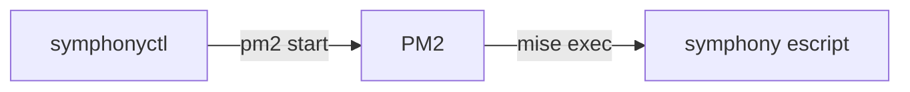

# 런처

`symphonyctl`은 Symphony 인스턴스를 PM2 프로세스로 관리하는 CLI다. 인스턴스는 target 별칭과 워크플로의 조합이고, 실행 본체는 `elixir/bin/symphony` escript, 프롬프트는 `workflows/<워크플로>.md`다.



진입점은 `src/symphonyctl.ts`다. Node 24의 네이티브 type stripping으로 TypeScript를 그대로 실행하므로 빌드가 없다. 외부 입력인 `targets.json`과 PM2 응답은 Zod로 파싱한다. 저장소를 처음 설치하거나 의존성이 바뀌면 저장소 루트에서 `pnpm install`을 실행해야 한다. PM2와 `mise`는 `PATH`에서 해석하므로 전역 설치가 필요하다.

저장소 루트에서 `pnpm install:symphonyctl`을 실행하면 `~/.local/bin/symphonyctl`이 진입점을 가리키는 절대 심볼릭 링크로 설치된다. 일반 셸과 `symphonyctl`을 호출하는 데몬의 `PATH`에 `~/.local/bin`이 있어야 한다. 저장소를 옮겼으면 명령을 다시 실행한다.

escript는 다음 인자로 기동한다.

- `--logs-root ~/.local/state/symphony/<별칭>/<워크플로>`: 인스턴스별 로그 루트. escript는 그 아래 `log/symphony.log.<N>` 순환 파일에 기록한다.
- `--i-understand-that-this-will-be-running-without-the-usual-guardrails`: 업스트림의 무인 실행 확인 플래그. 런처는 이 플래그를 항상 전달하므로 모든 인스턴스가 이 확인을 승인한 상태로 기동된다.
- `--port`는 넘기지 않으므로 상태 대시보드는 시작되지 않는다. 작업 관측은 Slack 알림([`notifier/`](../notifier/README.md))과 트래커가 맡는다.

## 명령

```sh
symphonyctl start <별칭>... [--workflow <워크플로>]
symphonyctl start --all [--workflow <워크플로>]
symphonyctl start --all --with-notifier
symphonyctl restart [<별칭>...] [--workflow <워크플로>]
symphonyctl restart --with-notifier
symphonyctl stop [<별칭>...] [--workflow <워크플로>]
symphonyctl stop --with-notifier
symphonyctl ls
symphonyctl logs <별칭> --workflow <워크플로>
symphonyctl run <별칭> --workflow <워크플로>
symphonyctl notifier start|stop|restart
```

- `--workflow`를 생략하면 별칭의 활성 워크플로 전체가 대상이다 (`logs`, `run` 제외). `restart`와 `stop`은 별칭까지 생략하면 실행 중인 인스턴스 전체가 대상이고, `--all`은 받지 않는다.
- `--all`은 `start` 전용으로 레지스트리 전체를 기동한다. `--workflow`와 함께 쓰면 해당 워크플로를 켜지 않은 target은 오류 없이 건너뛴다. 별칭으로 지정한 target에 그 워크플로가 없으면 실패한다.
- `start`는 online 상태인 인스턴스만 건너뛴다. errored 등 다른 상태로 등록돼 있으면 `pm2 delete` 후 새로 등록한다.
- `stop`은 `pm2 stop`이 아니라 `pm2 delete`로 등록을 해제한다. 등록된 프로세스는 모두 실행 중이어야 한다는 전제를 유지하기 위해서다.
- `ls`는 레지스트리의 모든 활성 인스턴스와 PM2 프로세스를 결합한 상태 JSON 객체 하나를 표준 출력에 쓴다. `--json` 옵션은 받지 않는다.
- `--with-notifier`는 기기 전체 조작인 `start --all`, 인자 없는 `restart`, 인자 없는 `stop`에서만 쓸 수 있다. 일부 별칭이나 워크플로에 notifier를 결합하면 명령을 실행하기 전에 실패한다.
- `start --all --with-notifier`는 설정과 의존성을 모두 검증하고 알림 서버를 시작한 뒤 [상태 확인 응답](../notifier/README.md#상태-확인)을 최대 10초 동안 기다린다. 응답을 확인한 뒤에만 활성 인스턴스를 시작한다. `stop --with-notifier`는 PM2에 등록된 모든 Symphony 인스턴스, 알림 서버 순으로 중지한다. `restart --with-notifier`는 알림 서버와 기존 인자 없는 `restart` 대상 전체를 재시작한다.
- 조작 명령은 목표 상태에 이미 도달한 대상을 변경하지 않는다. 일부 PM2 조작이 실패하면 앞선 변경을 롤백하거나 별도 스냅샷으로 저장하지 않는다. 현재 상태는 `ls`로 다시 확인한다.
- `logs`는 escript가 남기는 disk_log 순환 파일 중 최근 파일을 마지막 100줄부터 `tail -f`로 따라간다.
- `run`은 PM2를 거치지 않고 같은 명령을 전면에서 실행한다. 디버깅용이다. 현재 셸 환경은 상속하지 않고 시스템 필수 변수(`HOME` 등)와 주입 환경변수만 전달해 PM2 실행과 같은 조건을 유지한다.
- `notifier`는 알림 서버([`notifier/`](../notifier/README.md)) 전용 하위 명령이다. 인스턴스가 아니므로 별칭과 워크플로가 없다. 로그는 `pm2 logs symphony:notifier`로 확인한다.

## 출력 규격

`ls`와 조작 명령은 진행 메시지, ANSI 코드, 사람용 표 없이 표준 출력에 JSON 객체 하나만 쓴다. `symphonyctl`이 실행한 PM2 명령의 출력도 캡처하므로 응답에 섞이지 않는다. `logs`와 `run`은 전면 프로세스의 출력을 그대로 사용하고, 인자 없는 호출과 `help`는 사용법을 텍스트로 출력한다.

### 상태

`ls` 응답의 `schemaVersion`은 현재 `1`이다. 배열은 별칭과 워크플로, 프로세스 이름 기준으로 정렬한다. 출력에는 `targets.json`의 실행 설정, `~/.config/symphony/env`의 값, PM2 환경변수 등 인증 정보가 포함되지 않는다.

```json
{
  "schemaVersion": 1,
  "status": "partial",
  "instances": [
    {
      "alias": "myrepo",
      "workflow": "linear",
      "status": "online",
      "registered": true,
      "pid": 43120,
      "startedAt": "2026-08-23T12:34:56.000Z"
    },
    {
      "alias": "myrepo",
      "workflow": "pr-author",
      "status": "stopped",
      "registered": false,
      "pid": null,
      "startedAt": null
    }
  ],
  "orphanedProcesses": [
    {
      "processName": "symphony:pr-reviewer:oldrepo",
      "alias": "oldrepo",
      "workflow": "pr-reviewer",
      "status": "stopped",
      "registered": true,
      "pid": null,
      "startedAt": null
    }
  ],
  "notifier": {
    "status": "online",
    "registered": true,
    "pid": 43100,
    "startedAt": "2026-08-23T12:34:50.000Z"
  }
}
```

| 필드 | 규격 |
| --- | --- |
| `status` | 기기 전체 집계 상태. `online`, `stopped`, `partial`, `transitioning`, `errored` 중 하나다 |
| `instances` | `targets.json`에서 활성화한 모든 대상과 워크플로 조합이다. PM2에 없으면 `status: "stopped"`, `registered: false`로 남는다 |
| `orphanedProcesses` | `symphony:` 접두사로 PM2에 등록됐지만 현재 활성 인스턴스나 notifier가 아닌 프로세스다. 이름을 인스턴스 ID로 해석할 수 없으면 `alias`와 `workflow`가 `null`이다 |
| `notifier` | 기기당 하나인 notifier 상태다. PM2에 없으면 `status: "stopped"`, `registered: false`다 |
| `registered` | 해당 리소스가 PM2에 등록됐는지 나타낸다. 등록된 PM2 프로세스 자체가 `stopped`인 경우에도 `true`다 |
| `pid` | 실행 중인 프로세스의 PID다. PM2가 PID를 `0`으로 보고하거나 프로세스가 등록되지 않았으면 `null`이다 |
| `startedAt` | PM2의 시작 시각을 UTC ISO 8601 문자열로 변환한 값이다. PM2가 시작 시각을 `0`으로 보고하거나 프로세스가 등록되지 않았으면 `null`이다 |

리소스의 `status`는 PM2 상태를 그대로 보존하는 안정적인 영어 식별자다. 허용값은 `online`, `launching`, `stopping`, `stopped`, `errored`, `waiting restart`, `one-launch-status`다. 알 수 없는 상태는 임의로 변환하지 않고 PM2 입력 스키마 오류로 처리한다.

기기 전체 `status`는 활성 인스턴스, notifier, orphan 프로세스를 모두 포함해 다음 우선순위로 계산한다.

1. 하나라도 `errored`면 `errored`다.
2. 그 외에 하나라도 `launching`, `stopping`, `waiting restart`, `one-launch-status`면 `transitioning`이다.
3. 모두 `stopped`면 `stopped`다.
4. 모두 `online`이면 `online`이다.
5. 나머지 조합은 `partial`이다.

### 조작 결과

`start`, `restart`, `stop`, `notifier start|restart|stop` 응답의 `schemaVersion`도 `1`이다. `command`는 실행한 동작이고, `results`는 실제 처리 순서대로 대상별 결과를 담는다. 선택된 인스턴스가 없으면 빈 배열이다. `--with-notifier`를 지정하면 notifier도 결과에 포함하며, 직접 실행한 notifier 명령은 대상이 notifier인 결과 하나를 반환한다.

```json
{
  "schemaVersion": 1,
  "command": "restart",
  "results": [
    {
      "target": { "type": "notifier" },
      "outcome": "restarted"
    },
    {
      "target": {
        "type": "instance",
        "alias": "myrepo",
        "workflow": "linear"
      },
      "outcome": "restarted"
    }
  ]
}
```

| 필드 | 규격 |
| --- | --- |
| `command` | `start`, `restart`, `stop` 중 하나다. notifier 명령은 하위 동작을 이 값으로 쓴다 |
| `target.type` | `instance` 또는 `notifier`다 |
| `target.alias`, `target.workflow` | 인스턴스 대상에만 있다 |
| `outcome` | `started`, `restarted`, `stopped`, `unchanged` 중 하나다. `restart` 대상이 등록되지 않아 새로 시작했으면 `started`다 |

`start`가 이미 online인 대상을 만나거나 `notifier stop`의 프로세스가 등록되지 않았으면 `unchanged`다. `stop`은 등록된 프로세스에서 대상을 찾으므로 일치하는 인스턴스가 없으면 결과가 비어 있다.

### 오류

오류는 표준 오류에 JSON 한 줄을 쓰고 종료 코드 `1`을 반환한다. 명령 파싱이나 설정 읽기처럼 특정 조작 대상이 없는 오류에는 `message`만 있다. 대상 처리 중 실패하면 `stage`와 `target`을 추가한다. `stage`는 `validate`, `delete`, `start`, `health-check` 중 하나다.

```json
{"schemaVersion":1,"error":{"message":"PM2 start failed","stage":"start","target":{"type":"instance","alias":"myrepo","workflow":"linear"}}}
```

여러 대상을 처리하다 실패해도 표준 출력에는 성공한 앞선 결과를 쓰지 않는다. 오류 JSON에는 실패한 단계와 대상만 담으며, 성공한 변경은 `ls`에서 확인한다.

## 설정

로컬 설정은 저장소 밖 `~/.config/symphony/`에 두고 커밋하지 않는다. 두 파일 모두 필수라 없으면 기동 명령이 실패한다 (알림을 쓰지 않아도 `env`는 빈 파일로 둔다). 레지스트리 스키마가 어긋나면 프로세스를 건드리기 전에 실패한다.

- `targets.json`: target 레지스트리. 별칭을 키로 하는 객체이고, 별칭은 `^[a-z0-9-]+$` 형식만 허용한다. 문자열 설정은 양끝 공백을 제거한 뒤 비어 있지 않아야 한다.
- `env`: 인스턴스 공통 환경변수. Node.js의 `util.parseEnv`가 해석하는 dotenv 형식이다. `#` 주석, 키의 `export ` 접두사, 값의 따옴표를 지원하고 변수 확장은 지원하지 않는다. 형식에 맞지 않는 줄은 오류 없이 무시된다. `PATH`를 적어도 런처가 자신의 `PATH`로 항상 덮어쓴다. 알림 관련 키는 [`notifier/README.md`](../notifier/README.md)의 설정 절을 따른다.

```json
{
  "myrepo": {
    "repo": "acme/myrepo",
    "project": "59eaa65d2863",
    "workflows": {
      "linear": { "model": "gpt-5.6-terra", "model_reasoning_effort": "max" },
      "pr-author": {},
      "pr-reviewer": {}
    }
  }
}
```

| 필드 | 설명 |
| --- | --- |
| `repo` | 대상 GitHub 저장소 (`owner/name`) |
| `project` | Linear 프로젝트 슬러그. `linear` 워크플로를 켰으면 필수 |
| `workflows.<이름>` | 켤 워크플로. `linear`, `pr-author`, `pr-reviewer` 중에서 고른다 |
| `workflows.<이름>.model` | 에이전트 모델. 생략하면 주입하지 않아 워크플로 기본값을 쓴다 |
| `workflows.<이름>.model_reasoning_effort` | 추론 수준. 기본 `xhigh` |

## 주입 환경변수

공통 `env` 파일을 그대로 병합한 뒤 인스턴스별 값을 덧붙여 프로세스에 주입한다. 워크플로 frontmatter와 본문이 참조하는 인터페이스다.

| 환경변수 | 값 |
| --- | --- |
| `GITHUB_REPO` | target의 `repo` |
| `LINEAR_PROJECT_SLUG` | target의 `project` (`linear` 워크플로만) |
| `SYMPHONY_MODEL` | 워크플로 설정의 `model` (지정했을 때만) |
| `SYMPHONY_MODEL_REASONING_EFFORT` | 워크플로 설정의 `model_reasoning_effort` |
| `SYMPHONY_WORKSPACE_ROOT` | `~/.symphony/<별칭>/<워크플로>` |
| `SYMPHONY_INSTANCE_NAME` | 알림 스레드를 인스턴스별로 가르는 이름 (예: `Linear · myrepo`) |
| `SYMPHONY_WORKFLOW_LABEL` | 알림 본문에 표시하는 워크플로 레이블 |
| `SYMPHONY_TARGET_NAME` | 알림 본문에 표시하는 대상 이름 (별칭) |
| `PATH` | 런처 실행 시점의 `PATH`. pm2 데몬이 오래된 `PATH`를 유지하고 있어도 `mise`를 찾게 한다 |

## 프로세스 모델

- 프로세스 이름은 `symphony:<워크플로>:<별칭>`, 알림 서버는 `symphony:notifier`다. 워크스페이스와 로그 경로는 `<별칭>/<워크플로>` 구조다.
- fork 모드, `min_uptime` 10초, `max_restarts` 5, SIGTERM 후 15초 강제 종료로 등록한다.
- `pm2 startup`, `pm2 save`, `pm2 resurrect`를 사용하지 않으며 기기 재시작 뒤 프로세스 복원을 전제하지 않는다.
- `pm2 jlist` 응답은 프로세스 이름, 상태, 시작 시각, PID를 스키마로 검증한다. 형식이 어긋나면 기존 JSON, 배열, 프로세스, 필드 문맥을 포함한 오류로 명령을 중단한다.

## 코드 구조

```
package.json           # 워크스페이스 패키지, 실행 스크립트, 알림 서버 설정 인터페이스 의존성
tsconfig.json          # 런처 TypeScript 설정
install.sh             # ~/.local/bin/symphonyctl 심볼릭 링크 설치
src/symphonyctl.ts     # 직접 실행 가능한 CLI 진입점, 명령 파싱과 분기
src/command.ts         # CLI 인자 파싱과 옵션 조합 검증
src/registry.ts        # targets.json 파싱, 인스턴스 식별자와 프로세스 이름
src/env.ts             # 공통 env 파일 파싱, 인스턴스 환경변수 조립
src/runners.ts         # 인스턴스 선택과 start/restart/stop 실행 순서
src/notifier.ts        # 알림 서버 설정 검증, 기동, 상태 확인
src/output.ts          # 조작 결과와 오류의 JSON 출력 스키마
src/pm2-actions.ts     # PM2 변경과 설정 파일 기동
src/pm2.ts             # pm2 jlist 파싱
src/process.ts         # 실행 파일 탐색, 하위 프로세스 실행
src/logs.ts            # logs, run
src/list.ts            # ls JSON 출력
src/status.ts          # 기계용 상태 도메인, 집계, JSON 출력 스키마
src/constants.ts       # 경로와 프로세스 접두사
src/guards.ts          # 타입 가드
```

`targets.json`과 `pm2 jlist`는 각각의 Zod 스키마에서 검증한 뒤 도메인 타입으로 변환하고, 상태, 조작 결과, 오류는 별도 Zod 출력 스키마로 검증한다. 같은 디렉터리의 테스트에서 입력 파싱, 상태 집계, 출력 직렬화, 알림 서버 준비 대기, 기기 전체 조작 순서와 실패 처리를 검증한다 (저장소 루트에서 `pnpm test`).
