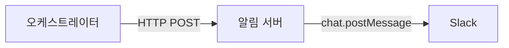
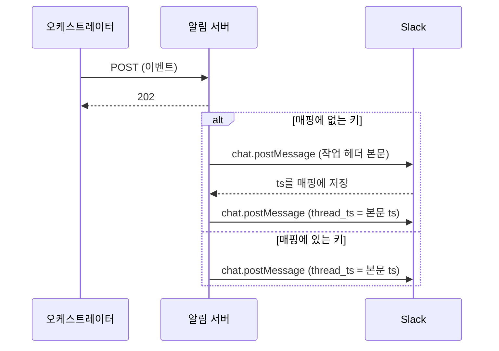

# 알림 서버

오케스트레이터가 보내는 작업 이벤트를 Slack 스레드로 전달한다. 무엇이 일어났는지(이벤트와 관측 가능한 사실)는 발신 측이 결정하고, 어떻게 보여줄지(메시지 조립, 템플릿, 스레드 정책)는 이 서버가 전담한다. 알림은 유실을 허용하는 보조 채널이고, 작업 상태의 원본은 트래커다.



오케스트레이터와 같은 머신에서 `127.0.0.1` 전용으로 수신한다. 이 바인딩이 보안 경계이며 요청 인증은 두지 않는다.

## 운영

- 런타임: Node.js 24 이상. 네이티브 type stripping으로 빌드 없이 `node`가 `src/main.ts`를 직접 실행한다.
- 패키지: pnpm. 의존성은 `hono`, `@hono/node-server`, `zod`, `@slack/web-api`.
- 프로세스: PM2. 인스턴스가 아니므로 별칭과 워크플로가 없다. 로그는 표준 출력으로만 남긴다.

```sh
pnpm install                  # 최초 1회. 의존성은 커밋하지 않고, 런처가 notifier/node_modules 존재를 요구한다
symphonyctl notifier start    # 기동 (이미 실행 중이면 그대로 둔다)
symphonyctl notifier restart  # 재시작
symphonyctl notifier stop     # 중지 (pm2 등록 해제)
symphonyctl notifier logs     # 표준 출력 추적
```

## 설정

인스턴스 공통 환경변수 파일 `~/.config/symphony/env`에 둔다. 런처가 이 파일을 읽어 프로세스에 주입하므로 알림 서버가 직접 읽지 않는다. 하나라도 없거나 형식이 어긋나면 시작에 실패한다.

| 환경변수 | 설명 |
| --- | --- |
| `SYMPHONY_NOTIFY_URL` | 발신 측이 POST할 URL이자 알림 기능의 스위치(없으면 오케스트레이터가 발신하지 않는다). 수신 포트와 엔드포인트 경로를 여기서 도출한다 (예: `http://127.0.0.1:4123/events`) |
| `SYMPHONY_SLACK_BOT_TOKEN` | Slack Bot 토큰 (`chat:write` 스코프) |
| `SYMPHONY_SLACK_CHANNEL` | 알림을 게시할 채널 ID |
| `SYMPHONY_SLACK_USER_ID` | 스레드 답글에서 멘션할 사용자 ID. `U` 또는 `W`(Enterprise Grid)로 시작하는 대문자·숫자 형식만 허용한다 |

수신 포트를 별도 환경변수로 두면 발신 URL의 포트와 어긋나도 발신 측의 연결 실패 로그로만 드러난다. URL 하나에서 도출해 그 가능성을 없앤다. `http` 스킴과 호스트 `127.0.0.1`, 명시된 포트가 아니면 부팅을 거부한다. 서버가 `127.0.0.1`에 바인딩하므로 호스트도 그 표기 하나만 허용하며, `localhost`는 발신과 수신의 IPv4/IPv6 리졸브가 갈릴 수 있어 배제한다. 발신 측(오케스트레이터)도 같은 규칙으로 검증해, 어긋난 값이면 이벤트마다 경고를 남기고 발신을 건너뛴다.

Slack 앱 생성과 토큰 발급은 [slack-app-setup.md](slack-app-setup.md)를 따른다.

## 이벤트 인터페이스

발신 측인 `elixir/lib/symphony_elixir/notifier.ex`와 공유하는 인터페이스다.

요청 본문을 동기로 검증한 뒤 즉시 응답하고, Slack 게시는 비동기로 처리한다. 검증 실패는 `400`, 성공은 `202`다. 발신자는 fire-and-forget이라 재시도하지 않지만, 2xx가 아닌 상태 코드는 경고 로그로 남긴다. `400`의 필드 오류 상세는 응답 본문에만 실리는데 발신 측이 본문을 버리므로 발신 로그에는 상태 코드만 남는다.

엔드포인트 경로는 `SYMPHONY_NOTIFY_URL`의 경로를 그대로 쓴다. 발신 URL 하나가 포트와 경로의 단일 출처다.

| 필드 | 타입 | 설명 |
| --- | --- | --- |
| `instance` | string | 인스턴스 이름 (`SYMPHONY_INSTANCE_NAME`) |
| `workflow` | string, 선택 | 워크플로 레이블 (예: `Linear`, `PR 저자`). 본문에 표시 |
| `target` | string, 선택 | 대상 저장소 또는 프로젝트 표시명. 본문에 표시 |
| `event` | string | 이벤트 종류. `started`, `retried`, `blocked`, `killed`, `settled`, `completed`, `finished`, `mergeable`을 정의한다 |
| `reason` | string, 선택 | 재시도, 차단, 강제 종료의 원인 |
| `dispatch_reasons` | string 배열, 선택 | 구조화된 디스패치 사유 (CI 실패, 미해결 피드백 건수, 리뷰 재요청 대기) |
| `observed` | string 배열, 선택 | 오케스트레이터가 관측한 상태 전환. 발신 측이 아직 보내지 않는 수신 측 예약 필드다 |
| `agent_message` | string, 선택 | 에이전트 세션의 마지막 agent message 전문. `completed`, `blocked`에 실리고, 라우팅 상실로 실행 중이던 세션을 종료하는 `killed`에도 실린다. draining 세션의 요약은 `settled`가 아니라 직전의 `completed`에 실린다 |
| `issue.id` | string | 트래커 이슈의 불변 ID. 스레드 매핑 키의 구성 요소 |
| `issue.identifier` | string | 사람이 읽는 식별자 (예: `SYM-42`) |
| `issue.title` | string, 선택 | 이슈 제목. 표시용 |
| `issue.url` | string | 트래커 이슈 URL |
| `issue.state` | string | 이벤트 시점의 트래커 상태 |
| `issue.pr_author` | string, 선택 | PR 저자 로그인. PR 트래커 워크플로(저자, 리뷰어) 양쪽의 본문에 표시 |

`mergeable`은 어댑터가 이슈에 표시한 수렴 도달(checks 통과와 필요 승인 충족으로 사람의 머지만 남음)을 오케스트레이터 폴링이 head sha당 한 번 발신한다. 이 억제 기억은 메모리 상태라 오케스트레이터가 재시작하면 같은 head에 다시 발신될 수 있다. 폴링 감지 경로의 종료는 발신 측이 셋으로 분류한다.

- `finished`: 워크플로의 순조로운 종결. 비활성·terminal 상태로의 정상 전환과 PR 머지다.
- `settled`: PR에 남은 디스패치 사유가 없어 다음 피드백까지 할 일이 없는 상태. 고장이 아니지만 종결도 아니다.
- `killed`: 그 외. 머지 없이 닫힌 PR, 트래커에서 회수된 이슈(라우팅 제외), 트래커에서 더 이상 보이지 않는 이슈다.

이 서버가 `reason` 문자열을 해석해 분류하는 방식은 자유 텍스트에 의존해 취약하므로 쓰지 않는다. 이벤트 종류와 분류는 관측 가능한 사실로만 정한다.

서사(수행 내용 요약)는 사실이 아니라 에이전트의 자기 보고이고, `agent_message` 필드로 전문이 그대로 운반된다. 이 서버는 내용을 해석하거나 판정하지 않고 첫 줄만 `에이전트 요약`으로 표기해 답글에 덧붙인다. 사실과 자기 보고를 표기로 구분해 두어야 잘못된 자기 보고가 관측 결과로 읽히지 않는다.

`event`는 열린 집합이다. Zod 스키마는 비어 있지 않은 문자열이면 통과시키고, 정의된 종류가 아니면 기본 템플릿으로 게시한다. 발신 측이 종류를 추가해도 수신 측 수정이 필요 없다.

```json
{
  "instance": "myrepo-linear",
  "event": "blocked",
  "reason": "운영자 승인 대기",
  "issue": {
    "id": "a1b2c3d4-0000-0000-0000-000000000000",
    "identifier": "SYM-42",
    "title": "알림 이벤트 발신 추가",
    "url": "https://linear.app/acme/issue/SYM-42",
    "state": "In Progress"
  }
}
```

## 메시징 동작

Bot 토큰으로 `chat.postMessage`를 호출한다. 스레드 답글(`thread_ts`)이 필수 요구라 Incoming Webhook은 쓸 수 없다.



### 스레드 매핑

하나의 작업 대상(트래커 이슈, PR)은 인스턴스당 스레드 하나만 쓴다. 본문은 작업 헤더이고, `started`를 포함한 모든 이벤트는 그 스레드의 답글이다.

- 매핑 키는 `${instance}:${issue.id}`이고, 값은 본문 메시지의 `ts`다. 로컬 JSON 파일 `~/.config/symphony/notifier-threads.json`로 영속화해 알림 서버가 재시작해도 같은 작업이 같은 스레드를 쓴다.
- 매핑에 없는 키의 이벤트는 작업 헤더 본문을 게시해 `ts`를 매핑에 저장하고, 그 스레드에 해당 이벤트 답글을 이어 게시한다.
- 매핑에 있는 키의 이벤트는 본문 `ts`를 `thread_ts`로 지정해 답글만 게시한다. 재디스패치의 `started`도 새 본문을 만들지 않는다.
- 어떤 이벤트도 매핑을 제거하지 않는다. 실행 완료 후 재디스패치가 흔한 PR 워크플로에서 완료 시 제거는 다음 실행을 새 본문으로 보내 스레드를 쪼갠다. 파일 크기는 항목 수 상한 500으로 정리하고, 삽입 순서가 오래된 항목부터 축출한다. 상한은 새 본문을 게시하는 시점에만 적용되고 로드 시점에는 정리하지 않는다. 상한에서 밀려난 작업의 이벤트는 새 본문으로 시작한다.
- 매핑 파일이 없거나 손상됐으면 빈 상태로 시작한다. 알림은 유실을 허용하는 보조 채널이라 매핑을 잃은 작업은 새 본문으로 다시 시작하면 된다.

### 순서와 실패 처리

같은 키의 이벤트는 도착 순서대로 직렬 게시한다. 키별 promise chain(`Map<key, Promise>`)으로 구현하고, 다른 키끼리는 병렬로 진행한다. 본문 게시가 끝나 `ts`를 확보한 뒤에만 답글을 게시할 수 있으므로 이 직렬화가 스레드 정합성의 근거다.

Slack 게시 실패는 로그만 남기고 무시한다. 본문 게시가 실패하면 매핑이 저장되지 않으므로 다음 이벤트가 자연히 새 본문을 시도한다. 체인 안에서 발생한 오류는 이후 이벤트 게시를 막지 않는다.

### 템플릿

본문은 mrkdwn 문법만 쓰므로 `text` 단독으로 게시하고, 답글은 Block Kit `blocks`로 게시한다. 에이전트 요약이 에이전트가 쓴 표준 마크다운(`[text](url)`, `**굵게**`)이라 `text`에 실으면 링크와 강조가 평문으로 노출되기 때문이다. `*강조*`처럼 두 문법의 의미가 갈리는 표기가 있어 mrkdwn으로의 변환은 원천적으로 부정확하므로, 요약은 변환 없이 `markdown` 블록에 원문 그대로 싣는다. 멘션(`<@{userId}>`)은 `markdown` 블록에서 렌더링되지 않으므로 상태줄은 mrkdwn `section` 블록에 둔다.

mrkdwn으로 게시하는 모든 외부 유래 문자열(본문 헤더와 상태줄의 각 세그먼트, 요약의 `text` 폴백)은 `&`, `<`, `>`를 이스케이프한다. 이스케이프하지 않으면 `<!channel>` 같은 특수 시퀀스가 해석되어 PR 제목으로 멘션을 위조할 수 있고 렌더링이 깨진다. `markdown` 블록의 요약 원문은 mrkdwn이 아니므로 이스케이프하지 않는다.

- 본문: `▶️ *{workflow} ({target})* <{url}|{identifier}> {title}`에 `issue.pr_author`가 있으면 ` (PR 저자: {pr_author})`를 붙인다. `workflow`나 `target`이 없으면 굵은 부분을 `{instance}`로 대체한다. 식별자가 `GH-<번호>` 형식이면 링크 텍스트를 `{identifier}` 대신 `PR #{issue.id}`로 표기한다.
- 답글의 `section` 블록: `<@{userId}> {emoji} {label} ({state})`에 `reason`이 있으면 ` — {reason}`을 붙이고, `dispatch_reasons`와 `observed`가 있으면 ` — 디스패치 사유: {목록}`, ` — 관측: {목록}` 순으로 잇는다.
- 답글의 `markdown` 블록: `agent_message`가 있으면 `section` 블록 뒤에 `↳ **(에이전트 요약)** {첫 줄}`을 담은 블록을 잇는다. 첫 번째 비어 있지 않은 줄만 쓰고 500자를 넘으면 `…`로 절단한다. 첫 줄을 요약으로 쓰는 요구는 워크플로 프롬프트가 걸지만 에이전트가 어길 수 있으므로 표현 계층에서 한 번 더 자른다. 절단 상한이 `markdown` 블록의 12,000자 한도보다 훨씬 낮아 한도는 고려하지 않는다.
- 답글의 `text`: 두 블록을 합친 문자열을 알림 미리보기와 스크린리더 폴백으로 항상 함께 보낸다. `text` 필드이므로 요약의 강조는 mrkdwn 문법(`*(에이전트 요약)*`)으로 쓴다.

`dispatch_reasons` 항목은 발신 측과 합의한 코드이고 이 서버가 한국어로 렌더링한다. 합의에 없는 코드는 원문 그대로 보여 발신 측이 코드를 추가해도 알림이 비어 보이지 않게 한다.

| 코드 | 렌더링 |
| --- | --- |
| `unresolved_threads:N` | 미해결 리뷰 스레드 N건 |
| `failing_checks:N` | CI 실패 N건 |
| `changes_requested` | 스레드 없는 Changes requested |
| `review_rerequest_pending` | 리뷰 재요청 대기 |

답글에만 멘션을 붙인다. 스레드를 팔로우하지 않으면 답글 알림이 오지 않아 차단, 중단이 묻히기 때문이다. 본문은 채널 메시지라 이미 알림 대상이다.

이모지는 신호색으로 상태를 구분한다. 초록 체크(✅)는 워크플로 종결의 의미로만 써서 스레드 마지막에 단 한 번 등장한다. 빨강(⛔ 🛑)은 순조롭지 않게 멈춰 사람 개입이 필요한 상태, 노랑(⚠️)은 실패했지만 시스템이 자체 처리 중인 주의 상태다. 진행 알림(▶️), 실행 1회의 정상 종료(⏭️), 사람 호출(🔔), 대기(💤), 미정의 이벤트(ℹ️)는 신호색을 쓰지 않는다.

레이블은 2글자 1단어로 통일한다. 실행 1회의 정상 종료는 워크플로의 종결로 오독되지 않도록 `완료` 같은 종결성 단어를 피해 `조치`로 쓴다. 같은 이유로 이모지도 ✅과 모양이 닮은 체크 계열을 피하고, 실행 하나가 끝나 다음 폴링으로 넘어간다는 뜻의 ⏭️를 쓴다.

| event | emoji | label |
| --- | --- | --- |
| `started` | ▶️ | 시작 |
| `retried` | ⚠️ | 실패 |
| `blocked` | ⛔ | 차단 |
| `killed` | 🛑 | 중단 |
| `settled` | 💤 | 대기 |
| `completed` | ⏭️ | 조치 |
| `mergeable` | 🔔 | 수렴 |
| `finished` | ✅ | 종결 |
| 그 외 | ℹ️ | `event` 문자열 그대로 |

### 스레드 예시

세 워크플로가 스레드를 어떻게 쌓는지 보여준다. 본문과 답글 상태줄은 mrkdwn, 요약 줄은 표준 마크다운 원문 그대로이고, 답글 맨 앞의 `<@{userId}>` 멘션만 생략했다. `reason`과 `agent_message`는 발신 측이 보내는 영어 원문 대신 흐름이 읽히도록 한국어로 옮겼다.

Linear 워크플로가 순조롭게 끝나는 경우다.

```
▶️ *Linear (acme/web)* <https://linear.app/acme/issue/SYM-42|SYM-42> 알림 이벤트 발신 추가

  └ ▶️ 시작 (Todo)
  └ ⏭️ 조치 (In Progress)
      ↳ **(에이전트 요약)** 발신 지점을 오케스트레이터의 런타임 전환 다섯 곳으로 좁혀 구현했고, 테스트를 남긴 채 턴이 끝났다.
  └ ▶️ 시작 (In Progress)
  └ ✅ 종결 (In Review) — Draft PR #128 생성 후 In Review로 이동
```

같은 워크플로가 차단으로 끝나는 경우다. 차단한 에이전트가 스스로 `agent` 레이블을 떼므로 다음 폴링에서 라우팅 제외로 🛑이 이어지고, 스레드는 초록 없이 끝난다.

```
▶️ *Linear (acme/web)* <https://linear.app/acme/issue/SYM-57|SYM-57> 결제 웹훅 재시도 정책 적용

  └ ▶️ 시작 (Todo)
  └ ⚠️ 실패 (In Progress) — 에이전트 종료: 턴 한도 초과
  └ ▶️ 시작 (In Progress)
  └ ⛔ 차단 (In Progress) — 검증 불가: 스테이징 웹훅 시크릿 미제공
      ↳ **(에이전트 요약)** 재시도 정책 구현은 마쳤지만 통합 테스트가 스테이징 시크릿을 요구해 검증을 끝내지 못했다. Workpad에 차단 사유를 기록했다.
  └ 🛑 중단 (In Progress) — `agent` 레이블 제거로 라우팅 제외
```

PR 저자 워크플로가 CI 실패에서 시작해 피드백 대응, 리뷰 재요청, 수렴을 거쳐 머지까지 가는 경우다.

```
▶️ *PR 저자 (acme/web)* <https://github.com/acme/web/pull/128|PR #128> 알림 이벤트 발신 추가 (PR 저자: octocat)

  └ ▶️ 시작 (open) — 디스패치 사유: CI 실패 1건
  └ ⏭️ 조치 (open)
      ↳ **(에이전트 요약)** 타이밍에 민감한 테스트 3건이 태그 누락으로 실패해 `:timing` 태그를 붙여 푸시했다.
  └ ▶️ 시작 (open) — 디스패치 사유: 미해결 리뷰 스레드 3건
  └ ⚠️ 실패 (open) — 에이전트 종료: 턴 한도 초과
  └ ▶️ 시작 (open) — 디스패치 사유: 미해결 리뷰 스레드 3건
  └ ⏭️ 조치 (open)
      ↳ **(에이전트 요약)** 2건은 수정해 푸시했고, 나머지 1건은 직전 커밋에서 이미 반영돼 근거를 스레드 답글로 남겼다.
  └ ▶️ 시작 (open) — 디스패치 사유: 리뷰 재요청 대기
  └ ⏭️ 조치 (open)
      ↳ **(에이전트 요약)** 이번 실행에서 푸시한 변경이 없어 현재 head를 보지 않은 리뷰어 octocat에게 리뷰를 재요청했다.
  └ ▶️ 시작 (open) — 디스패치 사유: 미해결 리뷰 스레드 1건
  └ ⏭️ 조치 (open)
      ↳ **(에이전트 요약)** 마지막 지적대로 경계 조건을 고쳐 푸시하고 스레드를 resolve했다.
  └ 💤 대기 (open) — 남은 디스패치 사유 없음
  └ 🔔 수렴 (open)
  └ ✅ 종결 (closed) — PR 머지
```

같은 PR을 보는 PR 리뷰어 워크플로다. 리뷰 왕복 끝에 승인하고, 리뷰 요청이 사라져 대기로 들어간 뒤 머지로 끝난다.

```
▶️ *PR 리뷰어 (acme/web)* <https://github.com/acme/web/pull/128|PR #128> 알림 이벤트 발신 추가 (PR 저자: octocat)

  └ ▶️ 시작 (open)
  └ ⏭️ 조치 (open)
      ↳ **(에이전트 요약)** 재시도 상한 누락, 실패 전파, 테스트 태그 누락 3건을 지적해 Request changes를 제출했다.
  └ ▶️ 시작 (open)
  └ ⏭️ 조치 (open)
      ↳ **(에이전트 요약)** 2건은 해소를 확인했고 재시도 상한의 경계 조건 1건이 남아 다시 Request changes를 제출했다.
  └ ▶️ 시작 (open)
  └ ⏭️ 조치 (open)
      ↳ **(에이전트 요약)** 남은 경계 조건 지적이 해소돼 Approve를 제출했다.
  └ 💤 대기 (open) — 남은 디스패치 사유 없음
  └ ✅ 종결 (closed) — PR 머지
```

⏭️는 에이전트 세션이 스스로 끝났다는 뜻이고, 💤은 대상에 디스패치 사유가 남지 않았다는 뜻이다. 에이전트의 조치가 자기 디스패치 사유를 지우면 같은 실행에서 ⏭️ 뒤에 💤이 이어진다. 💤은 PR 트래커에서만 나오고, Linear에서 같은 조건은 이슈 회수라 🛑이다. 🔔은 사람의 머지만 남았음을 알리는 호출이지 종결이 아니므로, 실제 머지를 관측한 뒤에야 ✅이 나온다.

두 PR 스레드는 같은 PR #128을 저자 인스턴스와 리뷰어 인스턴스가 각각 폴링해 갈라진 것이다. 매핑 키에 인스턴스 이름이 들어가는 이유다.

## 코드 구조

두 번째 사용 사례가 생기기 전까지 평면 구조를 유지한다. 사용 사례 확장은 라우트 파일 추가로 충분하다.

```
src/
  main.ts        # 시작: 설정 검증, Hono 앱 구성, 127.0.0.1 listen
  config.ts      # 환경변수 파싱·검증
  slack.ts       # WebClient 래퍼, 키별 직렬 게시, 스레드 매핑과 영속화
  events.ts      # 라이프사이클 이벤트 라우트: 페이로드 스키마, 게시 흐름
  templates.ts   # 본문 텍스트와 답글 블록 템플릿 (순수 함수)
```

순수 함수인 설정 파싱, 페이로드 스키마, 템플릿, 매핑 직렬화와 축출은 Vitest로 같은 디렉터리에서 테스트한다 (`pnpm test`). HTTP 서버, Slack 호출, 파일 입출력은 통합 지점이 얇아 테스트 대상에서 제외한다.

## 비범위

- LLM 호출: 포매팅은 템플릿으로 충분하고, 요약 줄은 `agent_message`의 첫 줄을 그대로 쓴다. 형식을 벗어난 최종 메시지도 다시 판단하지 않고 첫 줄 추출과 절단으로만 다룬다.
- 중복 억제, 이벤트 영속 저장: 반복 이벤트는 스레드에 쌓이고, 알림은 유실을 허용한다. 영속화 대상은 스레드 매핑뿐이고 이벤트 내용은 저장하지 않는다.
- 요청 인증: loopback 바인딩이 보안 경계다. 수신을 loopback 밖으로 넓히면 그때 도입한다.
